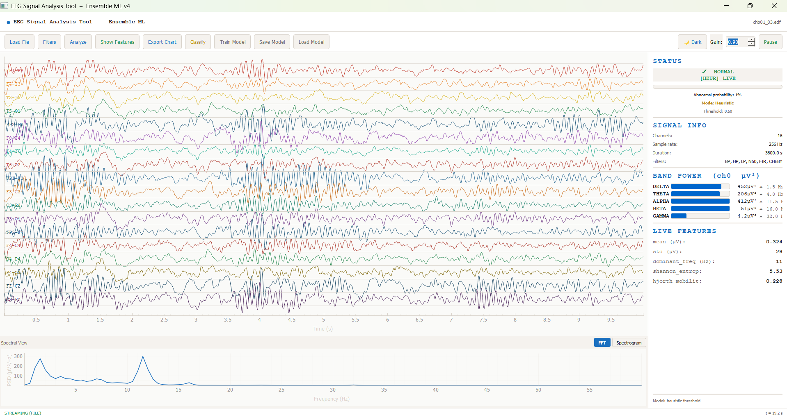
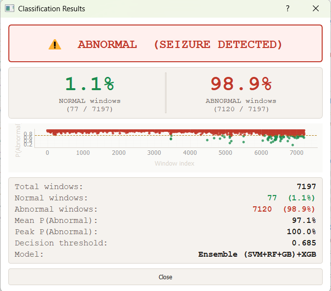

🧠 EEG Seizure Detection — Ensemble Machine Learning
> Real-time EEG signal analysis and automated seizure detection using a voting ensemble of machine learning classifiers.


---

## 📌 Overview
This system provides real-time EEG signal monitoring, feature extraction, and seizure classification using multiple machine learning models trained on clinical EEG data. It combines classical signal processing with ensemble learning to achieve robust neurological event detection.

---

## ✨ Features

| Feature | Details |
|--------|--------|
| 📡 Real-time streaming | 18-channel EEG — live file playback or synthetic demo |
| 🤖 Ensemble classifier | SVM + Random Forest + Gradient Boosting + XGBoost |
| 📊 Feature extraction | 40 features: time-domain, spectral, Hjorth, entropy, LZ complexity |
| 🎛️ Filter pipeline | Butterworth, FIR (Hamming), Chebyshev I, Notch (50 Hz) |
| 📈 Band power visualization | Delta / Theta / Alpha / Beta / Gamma |
| 🖥️ Interactive UI | PyQt5 desktop app with Light/Dark theme |
| 💾 Model persistence | Save & load trained models (.pkl) |

---

## 📊 Model Performance

| Model | AUC |
|------|------|
| SVM | 0.967 |
| CNN (baseline) | 0.981 |
| Random Forest | 0.958 |
| KNN | 0.931 |

> All models significantly outperform random baseline (AUC = 0.5)

---

## 🔬 Signal Processing Pipeline

- Raw EEG  
- Bandpass Filtering  
- Feature Extraction (40 features)  
- Robust Scaling  
- PCA (95% variance)  
- Recursive Feature Elimination (RFE)  
- Voting Ensemble Classifier  
- Seizure Probability Estimation  
- Final Decision (threshold-based)

---

## 📊 Extracted Feature Groups

- Time-domain: mean, std, variance, RMS, skewness, kurtosis, line length  
- Spectral: band powers (δ θ α β γ), spectral centroid, SEF50/SEF90  
- Nonlinear: entropy, Hjorth mobility & complexity, Teager energy  
- Complexity: Lempel-Ziv complexity, fractal dimension  
- Cross-channel: correlation, hemispheric asymmetry  

---
**🚀 Installation**
```bash
# Clone the repository
git clone https://github.com/wessamessam119/eeg-seizure-detection.git
cd eeg-seizure-detection

# Install dependencies
pip install PyQt5 pyqtgraph numpy scipy scikit-learn mne matplotlib xgboost
```
Optional (for XGBoost support)
```bash
pip install xgboost
```
---
▶️ Usage
```bash
python final.py
```

## 🔄 Workflow
- Load File — import .edf, .npy, .mat, .csv EEG recording  
- Apply preprocessing filters  
- Extract features + generate band power  
- Train model (normal vs abnormal EEG)  
- Run classification with probability timeline  
- Export visualization results  

---
**🖼️ Screenshots**
| Real-Time Monitoring | Classification Results |
|----------------------|------------------------|
|  |  |
---
**🗂️ Project Structure**
```
eeg-seizure-detection/
├── final.py                          # Main application
├── real_time_monitoring.png          # UI screenshot
├── classification_results_dashboard.png
├── workflow_diagram.png
├── README.md
├── LICENSE
└── .gitignore
```
---
🛠️ Tech Stack  
`Python 3.8+` · `PyQt5` · `pyqtgraph` · `scikit-learn` · `NumPy` · `SciPy` · `MNE` · `matplotlib` · `XGBoost`
---
📄 License  
This project is licensed under the MIT License — see LICENSE for details.
---
**🙋‍♀️ Author**  
**Eng. Wessam Essam**  
https://www.linkedin.com/in/wessam-aboalwafa-7a83b7320
